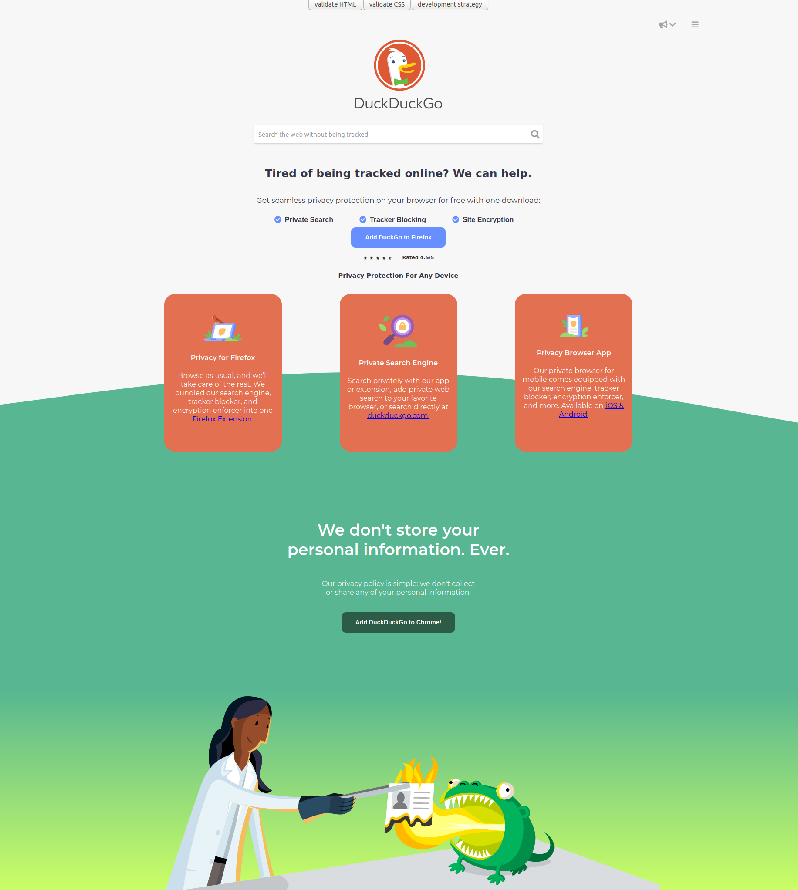

# duck-duck-clone

 This projectis an accessible & responsive clone of the DuckDuckGo home page.
 It is done on writing accessible HTML including correct Semantic HTML and ARIA. 
This project has been developed using the _development strategy_ concept with one branch and one issue per step.
It is a wy to practice git workflow skills working collaboratively.
## Table of contents
* [General info](#general-info)
* [Screenshots](#screenshots)
* [Technologies](#technologies)
* [Setup](#setup)
* [Features](#features)
* [Status](#status)
* [Inspiration](#inspiration)
* [Contact](#contact)

## General info
 - This project is a simple way to practice incremental development using git, github, html and css and Flexbox.
- The purpose is to use  _Git Workflow for Two_ for more practicing.
- For absolute beginner .
- Consist of header, search engine, features section and footer.
> This project use [w3-validation-template](https://github.com/HackYourFutureBelgium/w3-validation-template)

## Screenshots

## Technologies
* HTML5
* CSS3
* Git & Github

## Setup
There are several ways to run this run this project. one of them is to install Live Server extension in VS Code.

## Code Examples
Examples of usage:

            `code sample`

## Features
List of features :

* Responsive
* Accessible
* Applying Incremental Development 
* Flexible

To-do list:
* Add more interactivity using javascript
* Improve the performance

## Status
Project is: _under construction_

## Inspiration
Project inspired by  HYF

## Contact
Created by [@yared](https://github.com/yaredyilma),[@yildiray](https://github.com/yildiraykoyuncu),[@eltayeb](https://github.com/Eltayeb-Elgaali) - feel free to contact us!
